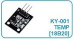
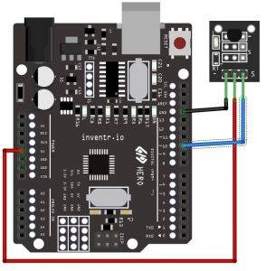

# KY-001 Temperature Sensor

The KY-001 is a simple temperature sensor module that measures ambient temperature using a DS18B20 digital thermometer chip.  The DS18B20 is a 1-Wire digital thermometer chip that is often used with the KY-001 temperature sensor module in electronics projects.

The DS18B20 provides 9-bit to 12-bit temperature readings in Celsius, with a temperature range of -55°C to +125°C and a temperature accuracy of ±0.5°C in the range of -10°C to +85°C.  The chip communicates with microcontrollers using the 1-Wire protocol, which allows multiple DS18B20 devices to be connected to a single microcontroller pin, making it a cost-effective solution for temperature sensing in various applications.

# Code
Included code can read up to 5 KY-001 modules and report temperatures for each.  Use Serial Plotter to display a graph of all temperatures.

# Wiring diagram

# Library
Install OneWire library from Arduino IDE library manager.
