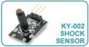
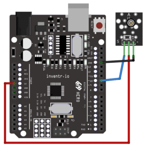

# KY-002 Shock Sensor

The KY-002 is a simple shock sensor module that detects vibrations or impacts. The module outputs a digital signal when triggered and can be used to detect knocks or movements in a variety of applications, such as detecting doors opening and closing or detecting knocks on a table.

# Wiring diagram

