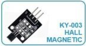
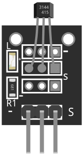
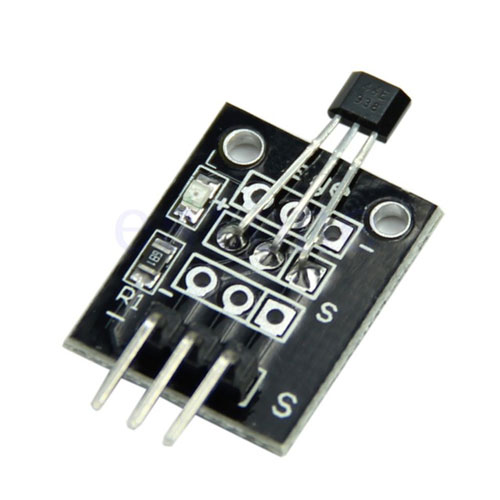
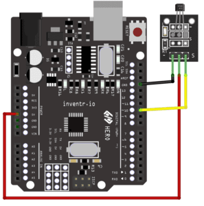

# KY-003 Hall Magnetic Sensor

The KY-003 is a magnetic Hall-effect sensor. It can detect the presence of a magnetic field and output an electrical signal proportional to the strength of the magnetic field. The sensor operates by using the Hall effect, which is the production of a voltage difference across an electrical conductor, transverse to an electric current in the conductor and a magnetic field perpendicular to it. The KY-003 is typically used in various applications such as detecting the position of a rotating magnet, or as a switch triggered by a magnet.

# Wiring diagram

