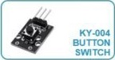
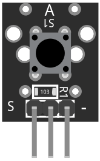
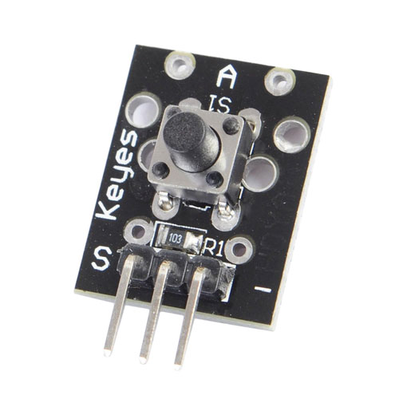
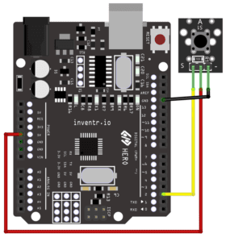

# KY-004 Button

The KY-004 is a simple tactile button module for use with Arduino or other microcontrollers. It consists of a push button switch and a resistor to pull the input high when the button is not pressed. When the button is pressed, the input is connected to ground, providing a low signal to the microcontroller. The module provides a convenient and compact way to add a physical button input to a microcontroller project.

# Wiring diagram

