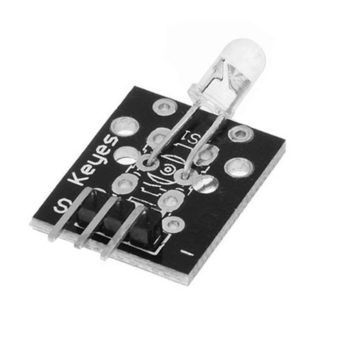
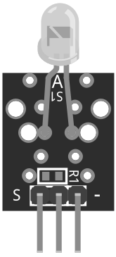

# KY-005 - IR Transmitter Module
NO CODE YET, until we can demonstrate this with second Hero and IR Receiver.

The KY-005 is an infrared (IR) transmitter module that is used to send IR signals. It typically includes an IR LED and a driver circuit to control the LED. The module is commonly used for remote control projects in electronics and can be used with microcontrollers such as the Arduino to transmit IR commands. It operates at a frequency of 38kHz and can be used to transmit signals to IR receivers or other IR devices.

# Wiring diagram
To connect the KY-005 IR transmitter module to the inventr.io Hero, you need to follow these steps:

* Connect the GND pin of the KY-005 to a GND pin on the Hero.
* Connect the S pin of the KY-005 to a digital pin on the Hero. It is recommended to use pin 3, but you can use any other digital pin that supports pulse-width modulation (PWM).

Since the KY-005 doesn't have a current limiting resistor it's recommended to add one between the S pin and the digital pin on the Arduino. The value of the resistor depends on the specifications of the IR LED, but a common value is 330 ohms.

Here's the wiring diagram:

* KY-005 GND pin -> Hero GND pin
* KY-005 S pin -> 330 ohm resistor -> Hero digital pin 3 (or any other PWM pin)

The resistor helps to limit the current going to the IR LED, protecting it from damage.

# Library
Likely to use IRremote library by shirriff, z3go and ArminJo
