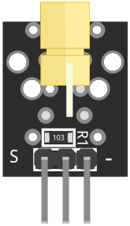
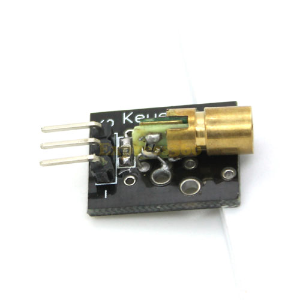
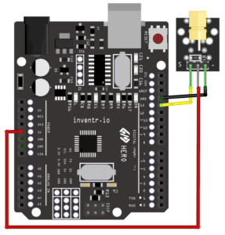

# KY-008 - Laser

The KY-008 is a laser transmitter module commonly used in DIY electronics projects such as robots or home automation systems. It operates at a wavelength of 650 nm and produces a red laser beam that can be used as a sensor or an indicator. The module can be easily connected to a microcontroller, such as an Arduino, and controlled with a few lines of code.

# Wiring diagram

