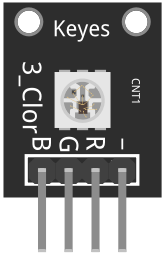
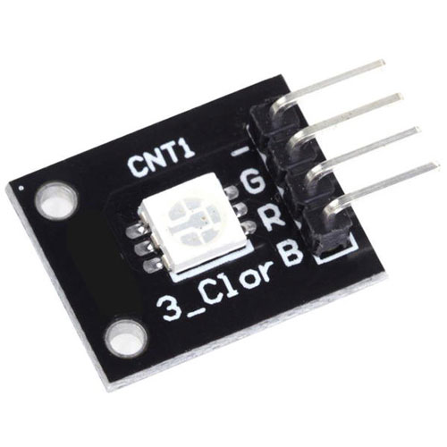
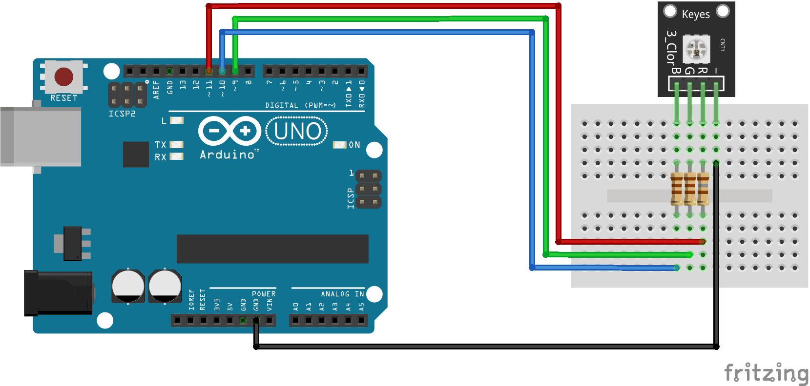

# KY-009 - SMD RGB LED

The KY-009 is a module that consists of an RGB (Red, Green, Blue) LED, which can emit various colors by mixing the intensities of the three individual colors. The module can be easily connected to a microcontroller like an Arduino, and is commonly used for adding colorful lighting effects to DIY electronics projects such as mood lights, ambilight systems, and more.

We use PWM pins for this device so that we can independently set the intensity of each LED.  You must use resistors between the board and the Arduino to prevent LED burnout.

NOTE: KY-009 in at least one kit had the colors on different pins than labled.  The pins on two tested modules were BRG-, not BGR- as labled (red and green swapped).

# Wiring diagram (replace with inventr.io branded.)

